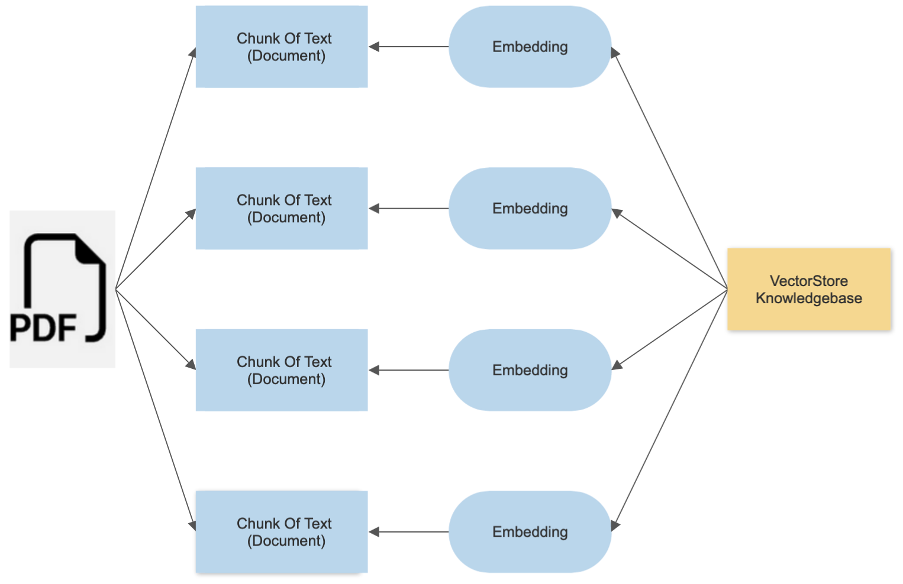
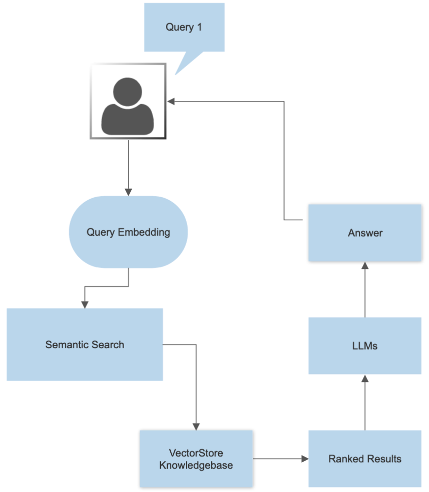

<a name="readme-top"></a>


<!-- PROJECT LOGO -->
<br />
<div align="center">
  <a href="https://github.com/ssinghtanwar/ALAA">
    
  </a>

<h3 align="center">ALAA (Arch Linux AI Assistant)"Using OpenAI"</h3>

  <p align="center">
    <br />
    <a href="https://github.com/ssinghtanwar/ALAA"><strong>Explore the docs »</strong></a>
    <br />
    <br />
    ·
    <a href="https://github.com/ssinghtanwar/ALAA/issues">Report Bug</a>
    ·
    <a href="https://github.com/ssinghtanwar/ALAA/issues">Request Feature</a>
  </p>
</div>

<!-- TABLE OF CONTENTS -->
<details>
  <summary>Table of Contents</summary>
  <ol>
    <li>
      <a href="#about-the-project">About The Project</a>
      <ul>
        <li><a href="#Primary Purpose">Primary Purpose</a></li>
        <li><a href='#Inspiration'>Inspiration</a></li>
      </ul>
    </li>
    <li><a href="#How it Works">How it Works</a></li>
    <li><a href="#Dependencies and Installation">Dependencies and Installation</a></li>
    <li><a href="#usage">Usage</a></li>
    <li><a href="#roadmap">Roadmap</a></li>
    <li><a href="#contributing">Contributing</a></li>
    <li><a href="#license">License</a></li>
    <li><a href="#contact">Contact</a></li>
  </ol>
</details>

<!-- ABOUT THE PROJECT -->

## About The Project

ALAA (Arch Linux AI Assistant) is an innovative open-source chatbot designed to assist users with various aspects of Arch Linux, a popular and advanced Linux distribution known for its simplicity, customization, and user-centric approach. Developed as a proof-of-concept, ALAA aims to bridge the gap between the powerful capabilities of open-source software and the demand for customer support typically associated with proprietary alternatives.

<p align="right">(<a href="#readme-top">back to top</a>)</p>

### Primary Purpose

The primary purpose of ALAA is to offer Arch Linux users a reliable and responsive virtual assistant that can help them navigate through the intricacies of the operating system. Unlike traditional customer support, which may not be feasible for many open-source projects, ALAA leverages cutting-edge language models, such as OpenAI's GPT-3.5, integrated with the Hugging Face framework, to provide intelligent and context-aware responses to users' queries.

### inspiration

The inspiration behind ALAA stems from the recognition that open-source projects often lack dedicated customer support channels due to their volunteer-driven nature. Consequently, some users may opt for proprietary software with customer support, even if it means sacrificing the benefits of open-source solutions. ALAA seeks to challenge this trade-off by offering a feature-rich and knowledgeable chatbot that can rival the support offered by proprietary alternatives.

<p align="right">(<a href="#readme-top">back to top</a>)</p>

<!-- How it Works -->

## How it Works

<br><br><br>
First I use "archPDf_VectorStore.py" to create "Arch_Index" vector database using "FAISS" and "Instructor" as embedding tool (How that Worked is shown in the image above) <br><br><br>
<br><br><br>
Then in app.py I import the vectorDatabase and create whole chat UI using stremlit and use OpenAI (ChatOpenAI) to get response using the vector database and embedding. (How that Worked is shown in the image above)

## Dependencies and Installation

To install the ALAA Chat App, please follow these steps:

1. Clone the repository to your local machine.
2. Install the required dependencies by running the following command:
   ```
   pip install -r requirements.txt
   ```
3. Obtain an API key from OpenAI and add it to the `.env` file in the project directory.
<p align="right">(<a href="#readme-top">back to top</a>)</p>

<!-- USAGE EXAMPLES -->

## Usage

To use the ALAA Chat App, follow these steps:

1. Ensure that you have installed the required dependencies and added the OpenAI API key to the `.env` file.
2. Run the `app.py` file using the Streamlit CLI. Execute the following command:

   ```
   streamlit run app.py
   ```

3. The application will launch in your default web browser, displaying the user interface.

4. Ask questions in natural language about Arch Linux using the chat interface.

<p align="right">(<a href="#readme-top">back to top</a>)</p>

<!-- ROADMAP -->

## Roadmap

- [ ] Creating and using better Arch wiki PDF
- [ ] Making it completely free (I didn't use LLMs that are free and opensource they need to be finetuned to give good enough results and to do that i will need a far better machine)
- [ ] Making Other ChatBot that are available for other distros and opensource projects
  - [ ] Gentoo
  - [ ] Garuda Linux
  - [ ] Bedrock Linux
  - [ ] More

See the [open issues](https://github.com/ssinghtanwar/ALAA/issues) for a full list of proposed features (and known issues).

<p align="right">(<a href="#readme-top">back to top</a>)</p>

<!-- CONTRIBUTING -->

## Contributing

Contributions are what make the open source community such an amazing place to learn, inspire, and create. Any contributions you make are **greatly appreciated**.

If you have a suggestion that would make this better, please fork the repo and create a pull request. You can also simply open an issue with the tag "enhancement".
Don't forget to give the project a star! Thanks again!

1. Fork the Project
2. Create your Feature Branch (`git checkout -b feature/AmazingFeature`)
3. Commit your Changes (`git commit -m 'Add some AmazingFeature'`)
4. Push to the Branch (`git push origin feature/AmazingFeature`)
5. Open a Pull Request

<p align="right">(<a href="#readme-top">back to top</a>)</p>

<!-- LICENSE -->

## License

Distributed under the AGPLv3. See `LICENSE.txt` for more information.
Copyright (C) 2023 Saurabh Singh Tanwar

    This program is free software: you can redistribute it and/or modify
    it under the terms of the GNU Affero General Public License as published
    by the Free Software Foundation, either version 3 of the License, or
    (at your option) any later version.

    This program is distributed in the hope that it will be useful,
    but WITHOUT ANY WARRANTY; without even the implied warranty of
    MERCHANTABILITY or FITNESS FOR A PARTICULAR PURPOSE.  See the
    GNU Affero General Public License for more details.

<p align="right">(<a href="#readme-top">back to top</a>)</p>

<!-- CONTACT -->

## Contact

Saurabh Singh Tanwar - [@twitter_handle](https://twitter.com/saurabh49764217) - saurabhstanwar@gmail.com

Project Link: [https://github.com/ssinghtanwar/ALAA](https://github.com/ssinghtanwar/ALAA)

<p align="right">(<a href="#readme-top">back to top</a>)</p>
